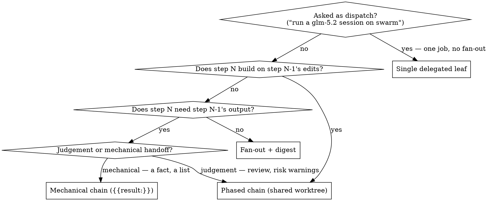

# Swarm Chained Worktrees Implementation Plan

> **For agentic workers:** REQUIRED SUB-SKILL: Use superpowers:subagent-driven-development (recommended) or superpowers:executing-plans to implement this plan task-by-task. Steps use checkbox (`- [ ]`) syntax for tracking.

**Goal:** Let a sequence of swarm tasks implement, review, and re-implement on one shared git worktree and branch, so phased work lands as one accumulated diff instead of N divergent branches — and fix the docs so agents can route a task to the right swarm shape, including the single delegated leaf the current docs actively forbid.

**Architecture:** `isolation` gains an object form `{ "worktree": "<name>" }` that names a shared worktree; the string form `"worktree"` becomes shorthand for `{ "worktree": "<task.id>" }`, so both go down one code path. `prepareIsolation` keys the branch and path off that name instead of `task.id`. `collect()` moves from per-task to per-group, running only after the group's last task, because it destroys unchanged worktrees and a read-only reviewer changes nothing. Load-time validation requires every pair of tasks sharing a name to be totally ordered by `after`. The docs half replaces size-based triage with a whose-budget-pays rule, names the single-delegated-leaf shape, and adds the shape-selection digraph the plugin has never had.

**Tech Stack:** Node.js ESM (`.mjs`), zero runtime dependencies, `node --test` with hand-rolled fakes (no mocking framework).

**Spec:** `docs/superpowers/specs/2026-08-17-swarm-chained-worktree-design.md`

## Global Constraints

- **Zero npm runtime dependencies.** Every import is a `node:*` builtin or a relative import inside `plugins/swarm/`.
- **ESM-only.** No `require()`, no `__dirname`, no top-level `return`.
- **Backwards compatibility is a hard requirement.** `"isolation": "worktree"` must behave exactly as it does today — same branch name (`swarm/<task.id>`), same path (`wt-<task.id>`), same per-task collection. Every existing test in `tests/worktree.test.mjs` and `tests/manifest.test.mjs` must pass unchanged.
- **Branch prefix always comes from config** (`cfg.worktreeBranchPrefix`, default `"swarm/"`), never hardcoded.
- **Validation errors teach.** Per `CLAUDE.md`, every new error names the field, the fix, and shows a correct inline example — one `validate` round-trip must reach green.
- **Test runner:** `node --test plugins/swarm/tests/<file>.test.mjs` from the repo root.
- **Windows:** absolute ESM imports in throwaway scripts need `file:///C:/...` URLs.

## Verified Baseline

A throwaway probe against current `main` confirmed the gap (this is the RED state Task 2 must flip):

```
rev sees phase1.txt? -> false
rev collect kept?    -> false   (unchanged tree is destroyed)
p2 sees p1's phase1.txt? -> false
p1 and p2 same path?     -> false
p1 and p2 same branch?   -> false
p2 branch log            : d4ff9cd init
```

## File Structure

| File | Responsibility | Change |
|---|---|---|
| `plugins/swarm/src/worktree.mjs` | worktree create/re-enter/collect | `prepareIsolation` takes a name; `collect` unchanged in body |
| `plugins/swarm/src/manifest.mjs` | manifest validation + normalization | accept object `isolation`, normalize to a `worktreeName`, add ordering/forEach/collision validation |
| `plugins/swarm/src/scheduler.mjs` | dispatch loop | resolve group membership, defer `collect` to the group's last task, per-group `worktreesKept` |
| `plugins/swarm/tests/worktree.test.mjs` | worktree unit tests | new shared-name tests |
| `plugins/swarm/tests/manifest.test.mjs` | validation tests | new teaching-error tests |
| `plugins/swarm/tests/scheduler.test.mjs` | integration | deferred-collect test |
| `plugins/swarm/skills/swarm/SKILL.md` | agent-facing docs | rewrite Chain pattern, add digraph, worked example, verifier mechanics, routing rewrite |
| `plugins/swarm/README.md` | user-facing docs | `isolation` object form, per-group `worktreesKept` |

**Docs-task gate:** `SKILL.md` edits are hook-blocked until `writing-skills+` is invoked (observed this session: the Edit tool returns `You MUST invoke /writing-skills+ before editing any SKILL.md`). Tasks 5 and 6 must invoke it as their first step. This is not optional and cannot be worked around.

---

### Task 1: Normalize `isolation` to a worktree name

Accept both forms in the manifest and collapse them to one normalized field. No behaviour change yet — `prepareIsolation` still keys off `task.id`, so this task is pure plumbing and every existing test stays green.

**Files:**
- Modify: `plugins/swarm/src/manifest.mjs:202-204` (validation), `:434` (normalization)
- Test: `plugins/swarm/tests/manifest.test.mjs`

**Interfaces:**
- Consumes: nothing from earlier tasks.
- Produces: normalized task field `worktreeName: string | undefined`. Set to `t.isolation.worktree` for the object form, `t.id` for the string form `"worktree"`, `undefined` when absent. `task.isolation` keeps its existing truthiness contract — code testing `task.isolation === "worktree"` is updated to test `task.worktreeName !== undefined` in Task 3.

- [ ] **Step 1: Write the failing test**

Add to `plugins/swarm/tests/manifest.test.mjs`:

```js
test("isolation object form normalizes to a shared worktree name", () => {
  const dir = mkdtempSync(join(tmpdir(), "swarm-iso-"));
  try {
    const p = join(dir, "m.json");
    writeFileSync(p, JSON.stringify({ tasks: [
      { id: "p1", model: "sonnet", isolation: { worktree: "feat" }, prompt: "a" },
      { id: "p2", model: "sonnet", after: ["p1"], isolation: { worktree: "feat" }, prompt: "b" },
      { id: "solo", model: "sonnet", isolation: "worktree", prompt: "c" },
    ] }));
    const plan = loadManifest(p, CFG, dir);
    equal(plan.errors.length, 0, JSON.stringify(plan.errors));
    const byId = Object.fromEntries(plan.tasks.map((t) => [t.id, t]));
    equal(byId.p1.worktreeName, "feat");
    equal(byId.p2.worktreeName, "feat");
    equal(byId.solo.worktreeName, "solo", "string form is shorthand for its own id");
  } finally { rmSync(dir, { recursive: true, force: true }); }
});

test("isolation object form rejects a non-string or empty worktree name", () => {
  const dir = mkdtempSync(join(tmpdir(), "swarm-iso-bad-"));
  try {
    const p = join(dir, "m.json");
    writeFileSync(p, JSON.stringify({ tasks: [
      { id: "p1", model: "sonnet", isolation: { worktree: "" }, prompt: "a" },
    ] }));
    const plan = loadManifest(p, CFG, dir);
    ok(plan.errors.some((e) => /worktree.*non-empty string/i.test(e)), JSON.stringify(plan.errors));
  } finally { rmSync(dir, { recursive: true, force: true }); }
});
```

- [ ] **Step 2: Run test to verify it fails**

Run: `node --test plugins/swarm/tests/manifest.test.mjs`
Expected: FAIL — the object form currently trips `isolation must be "worktree" when present`, and `worktreeName` is `undefined`.

- [ ] **Step 3: Write minimal implementation**

Replace the validation at `manifest.mjs:202-204`:

```js
if (t.isolation !== undefined) {
  const iso = t.isolation;
  const isObjectForm = iso && typeof iso === "object" && !Array.isArray(iso);
  if (iso !== "worktree" && !isObjectForm) {
    errors.push(
      `${l}: isolation must be "worktree" or { "worktree": "<name>" } (got ${JSON.stringify(iso)})\n` +
      `    private tree:  "isolation": "worktree"\n` +
      `    shared tree:   "isolation": { "worktree": "feat" }`
    );
  } else if (isObjectForm) {
    if (typeof iso.worktree !== "string" || !iso.worktree) {
      errors.push(
        `${l}: isolation.worktree must be a non-empty string naming the shared worktree — ` +
        `e.g. { "worktree": "feat" }`
      );
    } else if (!/^[A-Za-z0-9._-]+$/.test(iso.worktree)) {
      errors.push(
        `${l}: isolation.worktree '${iso.worktree}' must be filename-safe ` +
        `(letters, digits, dot, dash, underscore) — it becomes a directory and a branch name`
      );
    }
  }
}
```

In `normalizeTasks` at `manifest.mjs:434`, alongside the existing `isolation` handling, derive the name:

```js
const worktreeName = (isCompute || isManifest || t.isolation === undefined)
  ? undefined
  : (typeof t.isolation === "object" ? t.isolation.worktree : t.id);
```

and include `...(worktreeName !== undefined && { worktreeName })` in the returned task object.

- [ ] **Step 4: Run test to verify it passes**

Run: `node --test plugins/swarm/tests/manifest.test.mjs`
Expected: PASS, including all pre-existing tests.

- [ ] **Step 5: Commit**

```bash
git add plugins/swarm/src/manifest.mjs plugins/swarm/tests/manifest.test.mjs
git commit -m "Normalize swarm isolation to a worktree name"
```

---

### Task 2: Share the worktree by name

Make `prepareIsolation` key off the name. This is the task that flips the probe's RED to GREEN.

**Files:**
- Modify: `plugins/swarm/src/worktree.mjs:25-55`
- Test: `plugins/swarm/tests/worktree.test.mjs`

**Interfaces:**
- Consumes: `task.worktreeName` from Task 1.
- Produces: `prepareIsolation(task, cfg, resultsDir, opts)` returns `{ path, branch, head, repo, reused, name }`. `path` is `<resultsDir>/wt-<name>`, `branch` is `<prefix><name>`. `head` is the repo HEAD at creation; on re-entry of an existing tree it is the tree's **current** HEAD, so a follower's `collect()` diffstat spans the whole chain.

- [ ] **Step 1: Write the failing test**

Add to `plugins/swarm/tests/worktree.test.mjs`:

```js
function commitAll(cwd, msg) {
  spawnSync("git", ["add", "."], { cwd, windowsHide: true });
  spawnSync("git", ["-c", "user.name=t", "-c", "user.email=t@t", "-c", "commit.gpgsign=false",
    "commit", "-q", "-m", msg], { cwd, windowsHide: true });
}

test("two tasks sharing a worktree name land in one tree on one branch", () => {
  const repo = initRepo();
  const resultsDir = mkdtempSync(join(tmpdir(), "swarm-wt-res-"));
  try {
    const p1 = { id: "p1", worktreeName: "feat", originalCwd: repo, cwd: repo };
    const p2 = { id: "p2", worktreeName: "feat", originalCwd: repo, cwd: repo };

    const wt1 = prepareIsolation(p1, CFG, resultsDir);
    equal(wt1.branch, "swarm/feat", "branch comes from the name, not the task id");
    ok(wt1.path.endsWith("wt-feat"), `expected wt-feat, got ${wt1.path}`);

    writeFileSync(join(wt1.path, "phase1.txt"), "phase 1 work\n");
    commitAll(wt1.path, "phase 1");

    const wt2 = prepareIsolation(p2, CFG, resultsDir);
    equal(wt2.path, wt1.path, "second task re-enters the same tree");
    equal(wt2.branch, wt1.branch);
    ok(wt2.reused, "second task reuses rather than creates");
    ok(existsSync(join(wt2.path, "phase1.txt")), "p2 must see p1's committed work");
  } finally { cleanup(repo, resultsDir); }
});

test("a read-only middle link does not destroy the shared tree", () => {
  const repo = initRepo();
  const resultsDir = mkdtempSync(join(tmpdir(), "swarm-wt-res-"));
  try {
    const p1 = { id: "p1", worktreeName: "feat", originalCwd: repo, cwd: repo };
    const wt1 = prepareIsolation(p1, CFG, resultsDir);
    writeFileSync(join(wt1.path, "phase1.txt"), "work\n");
    commitAll(wt1.path, "phase 1");

    const rev = { id: "rev", worktreeName: "feat", originalCwd: repo, cwd: repo };
    const wtR = prepareIsolation(rev, CFG, resultsDir);
    equal(wtR.path, wt1.path);
    // The reviewer changed nothing, but its head is phase 1 — not the repo's init HEAD.
    const collected = collect(rev, CFG, wtR);
    ok(collected.kept === false || existsSync(wtR.path),
      "collect on a follower must not be what decides the shared tree's fate");
  } finally { cleanup(repo, resultsDir); }
});

test("string-form isolation keeps its per-task tree (regression)", () => {
  const repo = initRepo();
  const resultsDir = mkdtempSync(join(tmpdir(), "swarm-wt-res-"));
  try {
    const a = { id: "impl", worktreeName: "impl", originalCwd: repo, cwd: repo };
    const wt = prepareIsolation(a, CFG, resultsDir);
    equal(wt.branch, "swarm/impl");
    ok(wt.path.endsWith("wt-impl"));
  } finally { cleanup(repo, resultsDir); }
});
```

- [ ] **Step 2: Run test to verify it fails**

Run: `node --test plugins/swarm/tests/worktree.test.mjs`
Expected: FAIL — first test fails at `equal(wt1.branch, "swarm/feat")` with `swarm/p1`, matching the probe.

- [ ] **Step 3: Write minimal implementation**

In `worktree.mjs`, change lines 27-29:

```js
  const name = task.worktreeName || task.id;
  const prefix = cfg.worktreeBranchPrefix || "swarm/";
  const branch = `${prefix}${name}`;
  const path = resolve(join(resultsDir, `wt-${name}`));
```

In the re-entry branch (currently line 42), return the tree's current HEAD rather than the repo's, so a follower's diffstat spans the chain:

```js
  if (isRegisteredWorktree(path, repo)) {
    if (reset) {
      git(["reset", "--hard", head.stdout], path);
      git(["clean", "-fd"], path);
    }
    const treeHead = git(["rev-parse", "HEAD"], path);
    return {
      path, branch, name, repo, reused: true,
      head: (!reset && treeHead.status === 0) ? treeHead.stdout : head.stdout,
    };
  }
```

Add `name` to the create-path return as well.

- [ ] **Step 4: Run test to verify it passes**

Run: `node --test plugins/swarm/tests/worktree.test.mjs`
Expected: PASS, all pre-existing tests included.

- [ ] **Step 5: Commit**

```bash
git add plugins/swarm/src/worktree.mjs plugins/swarm/tests/worktree.test.mjs
git commit -m "Key swarm worktree identity off a shared name"
```

---

### Task 3: Defer collection to the group's last task

Without this, the reviewer's `collect()` destroys the tree mid-chain. This is a correctness requirement, not polish.

**Files:**
- Modify: `plugins/swarm/src/scheduler.mjs:780` (isolation dispatch), `:861-865` (collection)
- Test: `plugins/swarm/tests/scheduler.test.mjs`

**Interfaces:**
- Consumes: `task.worktreeName` (Task 1), `prepareIsolation` returning `name` (Task 2).
- Produces: `worktreesKept` entries shaped `{ name, branch, path, diffstat, taskIds: string[] }` — one per group, replacing the current one-per-task `{ id, branch, path, diffstat }`.

- [ ] **Step 1: Write the failing test**

Add to `plugins/swarm/tests/scheduler.test.mjs`, using the existing fake-io helpers:

```js
test("collect runs once, after the last task in a shared worktree group", async () => {
  const collectCalls = [];
  const fakeWorktree = {
    prepareIsolation: (task, cfg, resultsDir) => ({
      path: join(resultsDir, `wt-${task.worktreeName}`),
      branch: `swarm/${task.worktreeName}`,
      name: task.worktreeName,
      head: "abc123", repo: resultsDir, reused: collectCalls.length > 0,
    }),
    collect: (task, cfg, wt) => {
      collectCalls.push({ taskId: task.id, name: wt.name });
      return { kept: true, branch: wt.branch, path: wt.path, diffstat: "1 file changed" };
    },
  };

  const plan = planWith([
    { id: "p1", model: "sonnet", worktreeName: "feat", isolation: { worktree: "feat" }, prompt: "a" },
    { id: "rev", model: "sonnet", after: ["p1"], worktreeName: "feat", isolation: { worktree: "feat" }, prompt: "b" },
    { id: "p2", model: "sonnet", after: ["rev"], worktreeName: "feat", isolation: { worktree: "feat" }, prompt: "c" },
  ]);

  const io = makeIo({ spawn: fakeSpawnFactory({ default: { ok: true, output: "done" } }), worktree: fakeWorktree });
  const { worktreesKept } = await runPlan(plan, CFG, io);

  equal(collectCalls.length, 1, `collect must run once per group, got ${JSON.stringify(collectCalls)}`);
  equal(collectCalls[0].taskId, "p2", "collect runs after the LAST group member");
  equal(worktreesKept.length, 1, "one entry per group, not per task");
  deepEqual(worktreesKept[0].taskIds, ["p1", "rev", "p2"]);
});
```

Adapt `planWith` / `makeIo` to whatever the file's existing helpers are named — read the top of `tests/scheduler.test.mjs` first and follow its established shape rather than inventing one.

- [ ] **Step 2: Run test to verify it fails**

Run: `node --test plugins/swarm/tests/scheduler.test.mjs`
Expected: FAIL — `collectCalls.length` is 3, one per task.

- [ ] **Step 3: Write minimal implementation**

Before the dispatch loop in `runPlan`, compute each group's last member statically. The group is totally ordered (Task 4 enforces it), so the last member is the one no other member transitively precedes:

```js
// Tasks sharing a worktree name form one ordered chain; only its final member
// collects, because collect() destroys a tree whose diff is empty and a
// read-only reviewer mid-chain changes nothing.
const groupMembers = new Map();   // name -> [task ids, in manifest order]
for (const t of plan.tasks) {
  if (!t.worktreeName) continue;
  if (!groupMembers.has(t.worktreeName)) groupMembers.set(t.worktreeName, []);
  groupMembers.get(t.worktreeName).push(t.id);
}
const groupFinal = new Map();     // name -> id of the member that collects
const groupFirst = new Map();     // name -> id of the member that may --force reset
for (const [name, ids] of groupMembers) {
  const set = new Set(ids);
  const precedes = (id) => plan.tasks.find((t) => t.id === id)?.after?.filter((a) => set.has(a)) ?? [];
  groupFinal.set(name, ids.find((id) => !ids.some((o) => o !== id && precedes(o).includes(id))) ?? ids[ids.length - 1]);
  groupFirst.set(name, ids.find((id) => precedes(id).length === 0) ?? ids[0]);
}
```

Change the isolation guard at `:780` from `task.isolation === "worktree"` to `task.worktreeName !== undefined`, and scope the `--force` reset to the group's first member so re-running a later link never scrubs its predecessors' commits:

```js
wt = worktree.prepareIsolation(task, cfg, plan.resultsDir, {
  reset: force && groupFirst.get(task.worktreeName) === task.id,
});
```

Replace the collection block at `:861-865`:

```js
if (wt && groupFinal.get(task.worktreeName) === task.id) {
  const collected = worktree.collect(task, cfg, wt);
  result.worktree = collected;
  if (collected.kept) worktreesKept.push({
    name: wt.name, branch: collected.branch, path: collected.path,
    diffstat: collected.diffstat, taskIds: groupMembers.get(task.worktreeName),
  });
} else if (wt) {
  // Mid-chain link: record where it worked, but leave the tree for its successor.
  result.worktree = { kept: true, branch: wt.branch, path: wt.path, name: wt.name, pending: true };
}
```

Note: a failed group member never reaches this block (the failure path returns earlier), so its tree is kept with partial work intact — the existing resume behaviour, now applied to the chain.

- [ ] **Step 4: Run test to verify it passes**

Run: `node --test plugins/swarm/tests/scheduler.test.mjs`
Expected: PASS.

- [ ] **Step 5: Run the whole suite for regressions**

Run: `node --test plugins/swarm/tests/*.test.mjs`
Expected: PASS. Any failure mentioning `worktreesKept` shape is a real regression in a consumer (`results.mjs` renders it) — fix the consumer, do not weaken the assertion.

- [ ] **Step 6: Commit**

```bash
git add plugins/swarm/src/scheduler.mjs plugins/swarm/tests/scheduler.test.mjs
git commit -m "Collect a shared swarm worktree once, after its last link"
```

---

### Task 4: Validate total ordering, forEach, and name collisions

Three load-time rejections that make the concurrency hazard unreachable.

**Files:**
- Modify: `plugins/swarm/src/manifest.mjs` (near `validateTaskRelations`, `:212`)
- Test: `plugins/swarm/tests/manifest.test.mjs`

**Interfaces:**
- Consumes: `worktreeName` (Task 1), and the existing DFS reachability used by `detectCycle` (`manifest.mjs:122-145`).
- Produces: no new runtime fields — validation errors only.

- [ ] **Step 1: Write the failing test**

```js
test("tasks sharing a worktree must be totally ordered", () => {
  const dir = mkdtempSync(join(tmpdir(), "swarm-ord-"));
  try {
    const p = join(dir, "m.json");
    writeFileSync(p, JSON.stringify({ tasks: [
      { id: "p1", model: "sonnet", isolation: { worktree: "feat" }, prompt: "a" },
      { id: "p2", model: "sonnet", after: ["p1"], isolation: { worktree: "feat" }, prompt: "b" },
      { id: "p3", model: "sonnet", after: ["p1"], isolation: { worktree: "feat" }, prompt: "c" },
    ] }));
    const plan = loadManifest(p, CFG, dir);
    const msg = plan.errors.join("\n");
    ok(/p2.*p3|p3.*p2/.test(msg), `expected the unordered pair named: ${msg}`);
    ok(/after/.test(msg), "error must name the fix");
    ok(/"worktree"/.test(msg), "error must show a correct example");
  } finally { rmSync(dir, { recursive: true, force: true }); }
});

test("forEach cannot use a shared worktree", () => {
  const dir = mkdtempSync(join(tmpdir(), "swarm-fe-"));
  try {
    const p = join(dir, "m.json");
    writeFileSync(p, JSON.stringify({ tasks: [
      { id: "find", model: "sonnet", prompt: "a" },
      { id: "fix", model: "sonnet", after: ["find"], isolation: { worktree: "feat" },
        forEach: { from: "find", path: "", maxItems: 5 }, prompt: "b" },
    ] }));
    const plan = loadManifest(p, CFG, dir);
    ok(plan.errors.some((e) => /forEach.*shared worktree|shared worktree.*forEach/i.test(e)),
      JSON.stringify(plan.errors));
  } finally { rmSync(dir, { recursive: true, force: true }); }
});

test("a shared worktree name cannot collide with a private worktree task id", () => {
  const dir = mkdtempSync(join(tmpdir(), "swarm-col-"));
  try {
    const p = join(dir, "m.json");
    writeFileSync(p, JSON.stringify({ tasks: [
      { id: "feat", model: "sonnet", isolation: "worktree", prompt: "a" },
      { id: "p1", model: "sonnet", isolation: { worktree: "feat" }, prompt: "b" },
    ] }));
    const plan = loadManifest(p, CFG, dir);
    ok(plan.errors.some((e) => /collide|same path|already/i.test(e)), JSON.stringify(plan.errors));
  } finally { rmSync(dir, { recursive: true, force: true }); }
});

test("an ordered chain of three passes validation", () => {
  const dir = mkdtempSync(join(tmpdir(), "swarm-ok-"));
  try {
    const p = join(dir, "m.json");
    writeFileSync(p, JSON.stringify({ tasks: [
      { id: "p1", model: "sonnet", isolation: { worktree: "feat" }, prompt: "a" },
      { id: "rev", model: "sonnet", after: ["p1"], isolation: { worktree: "feat" }, prompt: "b" },
      { id: "p2", model: "sonnet", after: ["rev"], isolation: { worktree: "feat" }, prompt: "c" },
    ] }));
    const plan = loadManifest(p, CFG, dir);
    equal(plan.errors.length, 0, JSON.stringify(plan.errors));
  } finally { rmSync(dir, { recursive: true, force: true }); }
});
```

- [ ] **Step 2: Run test to verify it fails**

Run: `node --test plugins/swarm/tests/manifest.test.mjs`
Expected: the first three FAIL (no such validation yet); the fourth PASSES already.

- [ ] **Step 3: Write minimal implementation**

Add to `manifest.mjs`, called from the same place `detectCycle` is invoked (`:558` for the parent, `:490` for children):

```js
// Tasks sharing a worktree run in ONE directory, so they must form a single
// ordered chain — two unordered members would race and corrupt each other.
function validateWorktreeGroups(rawTasks, errors, label) {
  const nameOf = (t) => t.isolation === undefined ? undefined
    : (typeof t.isolation === "object" ? t.isolation.worktree : t.id);

  const groups = new Map();
  for (const t of rawTasks) {
    const n = nameOf(t);
    if (!n) continue;
    if (!groups.has(n)) groups.set(n, []);
    groups.get(n).push(t);
  }

  // Reachability over `after`, same edges detectCycle walks.
  const byId = new Map(rawTasks.map((t) => [t.id, t]));
  const reaches = (fromId, toId, seen = new Set()) => {
    if (fromId === toId) return true;
    if (seen.has(fromId)) return false;
    seen.add(fromId);
    return (byId.get(fromId)?.after || []).some((a) => reaches(a, toId, seen));
  };

  for (const [name, members] of groups) {
    if (members.length > 1 && members.some((t) => t.forEach !== undefined)) {
      errors.push(
        `${label(members.find((t) => t.forEach))}: a forEach task cannot use the shared worktree ` +
        `"${name}" — clones run concurrently and would collide in one directory. ` +
        `Use "isolation": "worktree" so each clone gets its own tree.`
      );
    }
    for (let i = 0; i < members.length; i++) {
      for (let j = i + 1; j < members.length; j++) {
        const [a, b] = [members[i], members[j]];
        if (!reaches(a.id, b.id) && !reaches(b.id, a.id)) {
          errors.push(
            `tasks '${a.id}' and '${b.id}' share worktree "${name}" but neither runs before the other.\n` +
            `    Tasks sharing a worktree must form a single ordered chain — add the missing\n` +
            `    \`after\` so one waits for the other:\n` +
            `        { "id": "${b.id}", "after": ["${a.id}"], "isolation": { "worktree": "${name}" }, … }`
          );
        }
      }
    }
  }

  // A shared name that equals another task's id would resolve to the same wt-<name> path.
  for (const [name, members] of groups) {
    const shared = members.filter((t) => typeof t.isolation === "object");
    if (!shared.length) continue;
    const clash = rawTasks.find((t) => t.id === name && typeof t.isolation === "string");
    if (clash) {
      errors.push(
        `shared worktree "${name}" collides with task '${clash.id}', which has its own private ` +
        `worktree of the same name — both resolve to wt-${name}. Rename one.`
      );
    }
  }
}
```

Call it after the existing relation validation, passing the same `label` helper.

- [ ] **Step 4: Run test to verify it passes**

Run: `node --test plugins/swarm/tests/manifest.test.mjs`
Expected: PASS (all four).

- [ ] **Step 5: Commit**

```bash
git add plugins/swarm/src/manifest.mjs plugins/swarm/tests/manifest.test.mjs
git commit -m "Reject unordered, forEach, and colliding shared swarm worktrees"
```

---

### Task 5: Teach the pattern — SKILL.md and README

The engine cannot enforce commit-per-link, so the docs carry it. The existing Chain section's advice to split chains across runs is the workaround this feature removes and must go.

**Files:**
- Modify: `plugins/swarm/skills/swarm/SKILL.md:157-189` (quick reference), `:218-228` (Chain pattern)
- Modify: `plugins/swarm/README.md` (manifest reference, results layout)

**Interfaces:**
- Consumes: the final manifest surface from Tasks 1-4.
- Produces: documentation only.

- [ ] **Step 0: Invoke the gate skill**

Run the `writing-skills+` skill before any `SKILL.md` edit. A `PreToolUse` hook blocks the Edit otherwise; there is no override.

- [ ] **Step 1: Update the manifest quick reference**

In `SKILL.md`, change the `isolation` line to show both forms:

```json
"isolation": "worktree",                   // private tree, implementation leaves only
"isolation": { "worktree": "feat" },       // SHARED tree — phased chains, see Plan patterns
```

- [ ] **Step 2: Add the shape-selection digraph**

Insert at the top of `## Plan patterns`, before `### Fan-out`.

Two authoring notes for whoever writes this. First, the discriminating question is whether step N **builds on** step N-1's *edits* — not whether the leaves touch the same repo. Several leaves editing disjoint files in one codebase is still fan-out with private trees, which is what swarm does today; only accumulation needs a shared tree. Second, the dispatch question comes first and short-circuits everything below it, because "run a glm-5.2 session on swarm" is an instruction, not a question to be triaged.

````markdown
Pick the shape before writing the manifest:


````

- [ ] **Step 3: Rewrite the Chain section**

Replace `### Chain — mechanical links only` (`:218-228`) with two patterns. Keep the existing mechanical-chain JSON example verbatim; **delete** its closing sentence *"Judgement-heavy chains split across runs — run a link, compress in-session, run the next"* — that workaround is what the phased chain replaces. Then add:

````markdown
### Phased chain — one branch, implement → review → implement

Phases of one feature that must accumulate on a single branch. Every link names the
same worktree; `after` orders them; the reviewer holds no write tools and warns the
next implementer through `{{result:}}`.

```json
{ "tasks": [
    { "id": "p1", "model": "glm-5.2:cloud", "isolation": { "worktree": "feat" },
      "allowedTools": "Read,Grep,Glob,Edit,Write,Bash",
      "prompt": "Phase 1: <scope>.\nCommit your work before you finish — the next link builds on your commits." },

    { "id": "p1-review", "model": "kimi-k2.7-code:cloud", "after": ["p1"],
      "isolation": { "worktree": "feat" }, "allowedTools": "Read,Grep,Glob",
      "prompt": "Review phase 1 in this worktree (git log/diff to see it).\nReturn ONLY: (a) defects with file:line, (b) risks phase 2 must avoid. No prose." },

    { "id": "p2", "model": "glm-5.2:cloud", "after": ["p1-review"],
      "isolation": { "worktree": "feat" },
      "allowedTools": "Read,Grep,Glob,Edit,Write,Bash",
      "prompt": "Phase 2: <scope>.\nThe phase-1 reviewer warned:\n{{result:p1-review}}\nFix what it flagged, then do phase 2. Commit before you finish." }
  ] }
```

**Rules that make it work:**

- **Every link names the same worktree.** All links sharing a name must be totally ordered by `after` — validation rejects an unordered pair, because they would race in one directory.
- **Reviewers get no write tools.** `allowedTools: "Read,Grep,Glob"`. A reviewer that edits is not reviewing, and a leaf holding `Write` can write anywhere — withholding the tool is the only real confinement.
- **Every implementing prompt must say "commit before you finish."** The engine never commits for a leaf. Uncommitted work still reaches the next link (same tree), but the history is what makes a failed link recoverable.
- **The tree is collected once**, after the last link — so one entry in `worktreesKept`, with a diffstat spanning every phase.
- **Re-running a link redoes its successors.** Transitive cache invalidation already handles this: fix p2, re-run, and p3/p4 redo their work on the corrected base.
- **`forEach` cannot share a worktree** — clones are concurrent by construction.

**How a verifier link works.** A reviewer with no write tools still does its whole job,
because its findings do not travel through files:

- **Its output is its return value.** The engine writes every leaf's result to
  `results/<id>.json`; the next link reads it via `{{result:<reviewer-id>}}`. A reviewer
  never needs `Write` to report — it needs `Write` only to *change* things, which is the
  one thing it must not do.
- **It sees more than a fresh checkout.** Same working directory as the link before it, so
  it reads that link's commits *and* anything left uncommitted. `git log`, `git diff`, and
  the files themselves all work.
- **It never ends the chain's tree.** Collection is deferred to the group's last link, so a
  reviewer changing nothing cannot trigger the empty-tree cleanup that would delete the
  work its successor needs.
- **Giving a reviewer write tools breaks the contract silently.** It will fix things
  instead of reporting them, and `{{result:}}` then describes work the next link cannot
  see the reasoning for. Nothing in the engine prevents this — `--allowedTools` is
  tool-name-only and a leaf holding `Write` can write anywhere — so the tool list is the
  whole mechanism.
````

- [ ] **Step 4: Update README.md**

In the manifest reference, add the object form beside `"isolation": "worktree"`. In the results-layout section, note that `worktreesKept` carries one entry per shared worktree group (`{ name, branch, path, diffstat, taskIds }`), not one per task.

- [ ] **Step 5: Verify the docs describe what the code does**

Run: `node --test plugins/swarm/tests/*.test.mjs`
Then hand-check each claim in the new SKILL.md section against a test that pins it: shared name → one tree (Task 2), reviewer survives (Task 2), collect-once (Task 3), unordered rejected (Task 4), forEach rejected (Task 4). Any claim with no pinning test is either wrong or needs one.

- [ ] **Step 6: Commit**

```bash
git add plugins/swarm/skills/swarm/SKILL.md plugins/swarm/README.md
git commit -m "Document the phased-chain swarm pattern"
```

---

### Task 6: Stop selling swarm as a fan-out-only tool

Three places tell the reader not to dispatch a single leaf, and the reason they give is job size. That reason was written when leaves were Claude-priced; a `:cloud` leaf spends no Anthropic budget, so size is the wrong axis. The right one is whose context and budget pay. Until these three lines change, the Task 5 digraph's `Single delegated leaf` box contradicts the prose around it.

**Files:**
- Modify: `plugins/swarm/skills/swarm/SKILL.md:4` (description/trigger), `:32` (triage), `:404` (anti-pattern), and `## Plan patterns` (new section)

**Interfaces:**
- Consumes: the `Single delegated leaf` box from Task 5's digraph.
- Produces: documentation only.

- [ ] **Step 0: Invoke the gate skill**

Run `writing-skills+` first — same hook block as Task 5.

- [ ] **Step 1: Amend the description so the skill loads for a dispatch request**

Line 4 currently ends `SKIP for: a single bounded question — answer it inline.` That clause decides whether the skill loads at all, so an agent asked to delegate one leaf never reaches the section teaching it how. Replace the whole description with:

```yaml
description: >-
  Use when a request fans out into 3+ independent bounded leaves, when alternative models
  are wanted for breadth or second opinions, or when one bounded task should run outside
  this session. Triggers — "swarm this", "fan out", "sweep", "judge panel", "run these in
  parallel", "use glm/minimax", "run a <model> session on swarm", "delegate this to a leaf".
```

- [ ] **Step 2: Replace size-based triage**

Line 32 reads `**Triage first**: when the whole job is under ~one leaf's cost (~30k tokens), read it yourself — don't swarm.` Replace with:

```markdown
- **Triage first**: the question is whose budget and context pay, not how big the job is.
  A `:cloud` leaf spends no Anthropic budget, so "too small to swarm" is not a reason on
  its own. Read it yourself when this session has context to spare and the answer is one
  read. Delegate a **single leaf** when it doesn't — see *Single delegated leaf* below.
  A request phrased as dispatch ("run a glm-5.2 session on swarm") has already made this
  call; honour it rather than re-triaging it.
```

- [ ] **Step 3: Delete the contradicting anti-pattern**

Remove line 404 entirely: `- Swarming a single bounded question — under ~one leaf's cost, read it yourself.` It restates the rule Step 2 replaced, and leaving it would contradict both the new triage line and the digraph.

- [ ] **Step 4: Add the Single delegated leaf pattern**

Add as the first section under `## Plan patterns`, ahead of `### Fan-out`:

````markdown
### Single delegated leaf

One leaf, no `after`, no digest needed. The shape for work that is perfectly doable inline
but shouldn't be — because the cost is context, not tokens.

When it applies:

- **This session's context is scarce.** A busy session buys headroom by sending a bounded
  job out and reading back a short result instead of the whole investigation.
- **A finished swarm missed something.** A follow-up leaf answers the gap without
  re-running the sweep or re-reading its raw output.
- **The result should be auditable.** A leaf leaves `results/<id>.json` and a run dir on
  disk; an inline read leaves only transcript.

```json
{ "tasks": [
    { "id": "check", "model": "glm-5.2:cloud",
      "prompt": "Your single job: <closed question>.\nFile scope: <paths>.\nReturn ≤10 bullets: claim, file:line. No prose. If you cannot answer, say so in one line." }
  ] }
```

Everything else still applies: one closed question, an explicit return contract, and the
Iron Law's hands-off rule once dispatched. Skip the digest — with one leaf, reading
`results/check.json` directly *is* the digest.
````

- [ ] **Step 5: Check for other places the fan-out-only framing leaks**

Run: `grep -n "fan out\|fan-out\|3+\|single bounded" plugins/swarm/skills/swarm/SKILL.md plugins/swarm/README.md plugins/swarm/skills/orchestrating-agents/SKILL.md`

For each hit, decide whether it describes swarm's *only* use or one of several. The title line (`# swarm — alternative-model fan-out engine`) and `README.md`'s opening are the likely remaining offenders. Fix framing, not vocabulary — "fan-out engine" as a name is fine if the surrounding text no longer implies fan-out is the only shape.

- [ ] **Step 6: Verify no contradiction survives**

Re-read the routing section, the anti-patterns list, and the new pattern section together. The test: an agent asked "run a glm-5.2 session on swarm to check X" must find nothing telling it to answer inline instead. If any line still does, it was missed in Step 5.

- [ ] **Step 7: Commit**

```bash
git add plugins/swarm/skills/swarm/SKILL.md plugins/swarm/README.md
git commit -m "Route single delegated leaves in the swarm skill"
```

**Open question for the operator, not for the implementer to decide:** the offer gate
(`SKILL.md:38`, MANDATORY) requires confirming spend before every dispatch. For a single
leaf the operator has usually already named the model and the job, so the confirmation is
friction. Whether the single-leaf shape is exempt from the gate is an operator call — the
gate was written after a real incident (2026-07-15) and this plan does not touch it. The
Iron Law's hands-off rule stays in force either way; it protects a live run rather than
gating spend.

---

### Task 7: End-to-end verification on a real repo

Every prior task used fakes or unit-level git. This proves the whole path with a real manifest and real worktrees.

**Files:**
- Create (throwaway, not committed): a scratch manifest and repo under the scratchpad dir.

- [ ] **Step 1: Build a real three-link chain**

Create a scratch git repo and a manifest with `p1` (write), `p1-review` (read-only), `p2` (write), all naming `{ "worktree": "chain-e2e" }`, ordered by `after`. Use the cheapest available model — the assertion is about worktree mechanics, not output quality.

- [ ] **Step 2: Validate before running**

Run: `node plugins/swarm/scripts/swarm.mjs validate <manifest>`
Expected: no errors, and the printed leaf count is 3.

- [ ] **Step 3: Run it**

Run: `node plugins/swarm/scripts/swarm.mjs run <manifest>`

- [ ] **Step 4: Assert the chain accumulated**

Check, in the run's results dir:
- exactly one `wt-chain-e2e` directory exists
- `git log --oneline` in it shows p1's and p2's commits on one branch
- `summary.json` `worktreesKept` has exactly one entry, `taskIds` listing all three
- `results/p1-review.json` shows the reviewer ran and its output reached p2's substituted prompt (`results/p2.json` `prompt` field contains the reviewer's text)

- [ ] **Step 5: Assert the ordering guard fires**

Edit the manifest so `p2` and `p1-review` both depend only on `p1`, re-run `validate`, and confirm it fails naming both ids and showing the `after` fix.

- [ ] **Step 6: Report findings and clean up**

Remove the scratch repo and worktrees (`git worktree remove`). Report the observed `git log` output verbatim — this is the evidence the feature works end to end, and per the project's verification rules the claim is not "proven" without it.

---

## Self-Review

**Spec coverage:**

| Spec section | Task |
|---|---|
| Manifest surface (object form, string shorthand) | 1 |
| Worktree resolution by name | 2 |
| `--force` scoped to the group's first link | 3 |
| Deferred collection | 3 |
| Total-ordering validation | 4 |
| forEach + name-collision validation | 4 |
| Reviewer convention | 5 (docs; enforced by the author's tool choice, per spec) |
| Verifier mechanics (output via `{{result:}}`, not files) | 5 |
| Commits per link | 5 (docs; engine never commits, per spec) |
| Results/reporting per group | 3 (shape), 5 (README) |
| Documentation + digraph | 5 |
| Single delegated leaf + routing rewrite | 6 (beyond the spec — see below) |
| Testing list | 2, 3, 4, 7 |

Every spec section maps to a task. The spec's "out of scope" items (merging back, concurrent chains sharing a tree) have no tasks, correctly.

**Scope beyond the spec.** Task 6 is not in `2026-08-17-swarm-chained-worktree-design.md`. It was added after the operator observed that swarm's docs sell it as a fan-out tool while they use it routinely to dispatch a single `:cloud` leaf, and that three lines actively forbid that use. It rides along because Task 5's digraph would otherwise contradict the prose it sits next to. It touches no engine code and can be reverted independently if the operator wants it split out.

**Task ordering note.** Tasks 5 and 6 both edit `SKILL.md` and will conflict if run in parallel. Run 6 after 5, or fold them into one editing pass — the digraph (5) and the routing rewrite (6) are the two halves of one coherent docs change.

**Type consistency:** `worktreeName` is the normalized field throughout (Tasks 1→2→3). `prepareIsolation` returns `name` (Task 2), consumed as `wt.name` (Task 3). `worktreesKept` entries are `{ name, branch, path, diffstat, taskIds }` in both Task 3's implementation and its test.

**Known adaptation point:** Task 3's test uses `planWith`/`makeIo` as placeholders for `tests/scheduler.test.mjs`'s actual helpers; Step 1 instructs the implementer to read that file's existing shape first. This is flagged rather than guessed because inventing a helper name that does not exist would be a worse failure than naming the adaptation.
