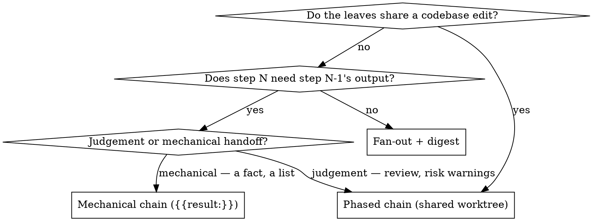

# Chained worktrees for swarm

## Problem

Swarm sequences tasks (`after`) and passes notes between them (`{{result:<id>}}`),
and it isolates write-capable leaves in git worktrees. But worktree identity is
derived solely from the task id — branch `${worktreeBranchPrefix}${task.id}`, path
`<resultsDir>/wt-<task.id>` (`src/worktree.mjs:28-29`). Nothing in the manifest can
change either, and no code path makes task A's worktree visible to task B.

So phased work on one branch is impossible. A four-phase feature with a review
between each phase produces eight worktrees on eight branches, each cut from the
same HEAD, none seeing the others' work. The interactive session must merge four
divergent branches by hand. The alternative — one agent doing all four phases —
runs out of context and compacts mid-flight.

The existing skill documents the workaround as the intended practice: *"Judgement-heavy
chains split across runs — run a link, compress in-session, run the next"*
(`skills/swarm/SKILL.md:220`). That is the gap, written down.

## What already works

Only two things are missing; the rest of the chain is built.

| Need | Status |
|---|---|
| Ordering between links | `after: ["p1"]` — ready-queue in `scheduler.mjs:947` |
| Notes passed forward | `{{result:id}}` inlines upstream output (capped); `{{resultPath:id}}` gives the full result file |
| Failed link blocks the rest | `depsDoomed` marks dependents `blocked` (`scheduler.mjs:550-553`) |
| Re-running a link redoes its successors | transitive cache invalidation over `after` (`scheduler.mjs:524-532`) |
| Per-leaf retry, resume, session reuse | `scheduleRetry`, `resumeId` (`scheduler.mjs:488-503`, `:775`) |
| **Shared worktree across links** | **missing** |
| **Deferred cleanup until the chain ends** | **missing** |

Transitive invalidation deserves emphasis: it is already the correct semantics for a
chain. Fix p2 and re-run, and p3/p4 redo their work on the corrected base. No new
machinery needed.

## Design

### Manifest surface

`isolation` accepts an object form naming a shared worktree:

```json
{ "id": "p1",     "isolation": { "worktree": "feat" }, "prompt": "…" }
{ "id": "p1-rev", "after": ["p1"], "isolation": { "worktree": "feat" },
                  "allowedTools": ["Read", "Grep"], "prompt": "Review. Warn p2." }
{ "id": "p2",     "after": ["p1-rev"], "isolation": { "worktree": "feat" },
                  "prompt": "Phase 2. Heed the reviewer: {{result:p1-rev}}" }
```

The string form `"isolation": "worktree"` keeps its current meaning exactly — a
private worktree named after the task. It is shorthand for
`{ "worktree": "<task.id>" }`, which makes the two forms one mechanism rather than
two.

Chain order comes from `after`. There is no new sequencing concept.

### Worktree resolution

`prepareIsolation` takes a name instead of deriving one from the task id:

- branch: `${worktreeBranchPrefix}${name}`
- path: `<resultsDir>/wt-${name}`

First task in a group creates it from HEAD (`--no-track`, as today). Later tasks find
it registered and re-enter it — which `isRegisteredWorktree` (`worktree.mjs:11-17`)
already does for same-id resume. The distinction between "resuming my own attempt" and
"joining a sibling's tree" matters only for logging.

`--force` semantics need care: today it hard-resets the tree. In a chain it must reset
only when re-running the *first* link, or it would scrub a predecessor's committed work
while re-running a later link. Reset applies when the task being forced is the group's
first, otherwise the tree is left as the predecessors left it.

### Deferred collection — a correctness requirement

`collect()` currently runs after each leaf, and **removes the worktree and deletes the
branch when nothing changed** (`worktree.mjs:60-80`). A read-only reviewer changes
nothing. So under today's logic, a reviewer link would destroy the tree the next
implementing link needs.

Collection therefore moves from per-task to per-group: it runs after the last task in
the group reaches a terminal state. "Last" is determined statically — the group member
with no other group member depending on it. Because the group is totally ordered
(below), that member is unique.

If any group member fails, the tree is kept regardless of diff state, so the partial
work is salvageable and resumable — matching the existing keep-on-failure behaviour.

### Validation — total ordering

Two tasks sharing a worktree name but not ordered relative to each other would run
concurrently in one directory and corrupt each other. This is rejected at load time,
alongside the existing `after` cycle detection (`manifest.mjs:122-145`).

Rule: for every pair of tasks sharing a worktree name, one must transitively precede
the other via `after`. Computed from the same DFS reachability the cycle check already
walks.

The error must teach, per the weakest-author rule in the project CLAUDE.md — naming the
field, the fix, and a correct example:

```
tasks 'p2' and 'p3' share worktree "feat" but neither runs before the other.
Tasks sharing a worktree must form a single ordered chain — add the missing
`after` so one waits for the other:
    { "id": "p3", "after": ["p2"], "isolation": { "worktree": "feat" }, … }
```

Two further validation rules:

- A `forEach` task may not name a shared worktree. Clones are concurrent by
  construction and would collide. (A `forEach` under `isolation: "worktree"` keeps
  today's per-clone trees.)
- A shared worktree name must not collide with a task id used by a private worktree
  elsewhere in the manifest, or the two would resolve to the same path.

### Reviewer links

Reviewers are read-only by convention, not by engine enforcement: give them
`allowedTools: ["Read", "Grep"]` and they inspect the accumulated tree, then write
findings to their output. The next link consumes those findings via
`{{result:<reviewer-id>}}`.

"Convention, not enforcement" is deliberate and consistent with what swarm can actually
promise. The deferred `swarm-write-tool-containment` plan established that `claude -p`
has no supported primitive confining writes to a path — `--allowedTools` is tool-name-only,
and a leaf granted `Write` can write anywhere. Withholding write tools from a reviewer is
therefore the real mechanism; there is nothing stronger available short of a PreToolUse
hook per leaf, which that plan deferred as unjustified.

Note the write-implies-isolation redirect (`manifest.mjs:413-416`) does not fire for
them — they have no write tools — and they now read a tree containing real work rather
than a bare checkout.

### Commits

Links commit their own work; the engine never runs git on the leaf's behalf. Agent
autonomy over granularity — one commit or several, as the work warrants.

Rationale: swarm already refuses to make git decisions for the user (it reports
`worktreesKept` and lets the session merge). Auto-committing at link boundaries would
cross that line, and would have to invent a commit message the leaf is better placed to
write.

The implementing-link prompt shape must therefore say so explicitly. This goes in the
skill, since the engine cannot enforce it:

```
Commit your work before you finish — the next link in this chain builds on
your commits, and uncommitted work is ambiguous to it.
```

Uncommitted changes still survive to the next link (same working tree), so a forgotten
commit degrades history rather than losing work.

### Results and reporting

`result.worktree` gains the group name so a drill-down shows which chain a leaf
belonged to. `worktreesKept` reports one entry per group rather than per task, with the
diffstat spanning the whole chain — which is what the session needs to merge.

## Documentation

Three changes, all in `skills/swarm/SKILL.md`:

1. **Rewrite `### Chain — mechanical links only`** (line 218). Its closing advice to
   split judgement-heavy chains across runs is the workaround this feature removes.
   It becomes two named patterns: *mechanical chain* (today's `{{result:}}` passing, no
   shared tree) and *phased chain* (shared worktree, implement/review links, commits per
   link).

2. **Add a decision digraph.** Neither skill has one. It routes a task to a shape:



3. **A worked phased-chain manifest** — four phases with reviewers between, showing
   the reviewer allowlist, the commit instruction, and a reviewer warning reaching the
   next implementing link.

`README.md` gets the `isolation` object form in its manifest reference and a line in
the results-layout section on per-group `worktreesKept`.

## Testing

Extending `tests/worktree.test.mjs` and `tests/manifest.test.mjs`:

- Two ordered tasks sharing a name resolve to one path and one branch.
- The second task sees the first's committed work (the core assertion — it fails today).
- A read-only middle link does not destroy the tree; the third link still sees phase-1 work.
- Collection runs once, after the last group member; the branch survives to `worktreesKept`.
- A failed middle link keeps the tree with partial work intact.
- Unordered same-name tasks fail validation with the teaching message.
- `forEach` + shared name fails validation.
- A shared name colliding with a private worktree's task id fails validation.
- String form `"isolation": "worktree"` behaves exactly as before (regression).
- `--force` on a later link does not scrub predecessors' commits.

Per the project's verification rules, each regression assertion is verified RED before
the implementation lands — particularly "the second task sees the first's work", which
must fail against current `main` for the right reason.

## Out of scope

- Merging chain branches back to the parent. `worktreesKept` reporting is unchanged in
  kind; the session still decides what to merge.
- Cross-run chain resumption beyond what transitive invalidation already gives.
- Concurrent chains sharing one tree. One tree, one ordered chain.
