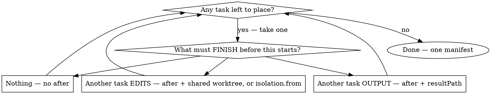

# Executing swarms — deciding the shape before anything spends

`swarm:orchestrating-agents` answers *which agents, and how many*. This skill answers *what
shape the graph takes* — what each task must wait for. Both precede drafting; neither
restates the other.

Work through it in order. Every step produces a value the manifest carries or the gate
consumes.

## The Iron Law

```
NO MANIFEST WITHOUT EVERY TASK PLACED BY ITS OWN DEPENDENCY ANSWER
```

**Violating the letter of this rule is violating its spirit.** Every task, one at a time,
answers *what must FINISH before this starts?* — and the graph is whatever those answers
build. You never choose a shape and fill it in.

**No exceptions:**
- Not "it's obviously a fan-out" — naming a shape before placing tasks IS choosing one.
- Not "I already know the six items, I'll write the six leaves" — a list you can enumerate
  now still needs `forEach` when it comes from a dependency's output at runtime.
- Not "the branches will merge cleanly" — sibling trees never see each other; a fold-back
  needs an `integrate` node, and its absence is silent.
- Not "the consumer can check its own input" — a verifier folded into the leaf it verifies
  is not a verifier.
- Not "this graph is too complex to write in one manifest" — every reason to split has a
  first-class field (§4). Only a human judgement between segments earns a second wave.

## 1. Grouping — invoke `swarm:orchestrating-agents` first

**Not optional, and not summarisable here.** That skill owns the onboarding arithmetic: a
fan-out's dominant fixed cost is onboarding (system prompt, rule files, project instructions,
tool schemas), re-paid at full rate by every agent with no cache credit across them, so
**every merge of two items into one leaf saves an entire onboarding.**

It produces the number the offer gate's third question carries. Drafting a leaf-per-item
manifest without it is precisely the failure it was written to catch.

## 2. Frame the contract — before the manifest, not after

**The five-part contract and where each clause lands is `swarm:swarm` → *Procedure* step 2.**
State it before you place a single task: the shape of the graph is decided by what each task
must produce, and you cannot answer that for a task whose contract you have not written.

A contract you cannot state is a manifest you cannot defend line by line, which is a manifest
you should not dispatch.

## 3. Place each task — the shape falls out, you never pick it

**A manifest is a dependency graph, not one pattern stamped across every task**:
take one task at a time and ask what must FINISH before it can start. Width falls out of the
answers; you never pick a shape.



Loop until every task is placed — one manifest holds as many segments as the work needs.

**Output vs edits is the discriminating question**, not whether leaves touch the same repo.
`{{result:}}` passes text, never changes.

### The names are descriptions, not a menu

A "fan-out" or a "chain" is what a *segment* of the graph looks like once its tasks are
placed. Naming one does not commit the rest of the manifest to it:

| A task answers… | That segment reads as |
|---|---|
| **nothing** | fan-out — independent leaves. Also a judge panel, when N leaves take one question |
| **another's output** | chain — each link consuming the last via `{{result:}}` / `{{resultPath:}}` |
| **the previous one edits** | phased chain — one shared worktree, implement → review → implement |
| **a list only known at runtime** | `forEach` — the leaf cloned per item of a dependency's result |
| **an earlier task's commits** | widening — `isolation.from` seeds private trees from that branch |
| **several branches at once** | `integrate` — an agentless merge folding them back into one tree |

**Width changes as often as the work demands.** A fan-out can feed a chain, which can end in
an `integrate`, which can re-branch into another fan-out, which integrates again — all in one
manifest. `1 → N → 1 → M → 1` is ordinary, not a special case, because each task is placed by
its own answer to "what must FINISH before this starts?" and nothing forces neighbouring
segments to share a shape.

The sections below are what those answers *produce* — descriptions, not a menu.


### Single delegated leaf

One leaf, no `after`, no digest — reading `results/<id>.json` *is* the digest. The shape for
work that is perfectly doable inline but shouldn't be: when this session's context is scarce,
when a finished swarm missed something, or when the result should be auditable on disk.

```json
{ "tasks": [
    { "id": "check", "model": "glm-5.2:cloud",
      "prompt": "Your single job: <closed question>.
File scope: <paths>.
Return ≤10 bullets: claim, file:line. No prose. If you cannot answer, say so in one line." }
  ] }
```

**The offer gate is a judgement call here, not a mandate** — it covers fan-out-shaped work
(3+ leaves). Say what you are about to dispatch and on which model so the operator can
redirect it, but a request already phrased as dispatch has made that call. `swarm:swarm`'s Iron
Law — hands off a live dispatch — applies in full once the leaf is running.

### Fan-out (the native shape)

N tasks, no `after`; digest synthesizes. Every investigation leaf prompt uses this fixed shape — one closed question per leaf, each answerable from a bounded file set:

```
Your single job: [SINGLE CLOSED QUESTION]

File scope: [the leaf's file scope]

Return your findings as ≤10 bullet points:
  • name/method/event, file path, line number, one-line description
No prose. No code blocks unless the exact token text is essential.
If you cannot find the answer, say so in one line — do not expand scope.
```

**One job per leaf.** If a leaf's scope turns out to hide a second question, add a *new* leaf with a new closed question — never widen an existing one.

```json
{ "tasks": [
    { "id": "auth",    "model": "minimax-m3:cloud", "prompt": "Your single job: where is session token expiry enforced?\nFile scope: src/auth/**\nReturn your findings as ≤10 bullet points: name, file path, line number, one-line description. No prose. If you cannot find the answer, say so in one line — do not expand scope." },
    { "id": "session", "model": "minimax-m3:cloud", "prompt": "…same shape, session-store cluster…" },
    { "id": "api",     "model": "glm-5.2:cloud",    "prompt": "…same shape, API-layer cluster…" }
  ],
  "digest": { "model": "glm-5.2:cloud", "instructions": "must_be_sure: the expiry enforcement point, with file:line. PROVEN/OPEN ledger required." } }
```

### Chain — mechanical links only

`{{result:<id>}}` passes raw (capped) output between links, so each link's *output* contract must be hard: **"return ONLY the N facts the next step needs."** It passes text, never edits — a link that must build on the previous link's *changes* needs a phased chain instead.


### Phased chain — one branch, implement → review → implement

Phases of one feature that must accumulate on a single branch. Every link names the
same worktree; `after` orders them; the reviewer holds no write tools and warns the
next implementer through `{{result:}}`.

```json
{ "tasks": [
    { "id": "p1", "model": "glm-5.2:cloud", "isolation": { "worktree": "feat" },
      "allowedTools": "Read,Grep,Glob,Edit,Write,Bash",
      "prompt": "Phase 1: <scope>.\nCommit your work before you finish — the next link builds on your commits." },

    { "id": "p1-review", "model": "kimi-k2.7-code:cloud", "after": ["p1"],
      "isolation": { "worktree": "feat" }, "allowedTools": "Read,Grep,Glob",
      "prompt": "Review phase 1 in this worktree (git log/diff to see it).\nReturn ONLY: (a) defects with file:line, (b) risks phase 2 must avoid. No prose." },

    { "id": "p2", "model": "glm-5.2:cloud", "after": ["p1-review"],
      "isolation": { "worktree": "feat" },
      "allowedTools": "Read,Grep,Glob,Edit,Write,Bash",
      "prompt": "Phase 2: <scope>.\nThe phase-1 reviewer warned:\n{{result:p1-review}}\nFix what it flagged, then do phase 2. Commit before you finish." }
  ] }
```

**Rules that make it work:**

- **Every link names the same worktree.** All links sharing a name must be totally ordered by `after` — validation rejects an unordered pair, because they would race in one directory.
- **Reviewers get no write tools.** `allowedTools: "Read,Grep,Glob"`. A reviewer that edits is not reviewing, and a leaf holding `Write` can write anywhere — withholding the tool is the only real confinement.
- **Every implementing prompt must say "commit before you finish."** The engine never commits for a leaf. Uncommitted work still reaches the next link (same tree), but the history is what makes a failed link recoverable.
- **The tree is collected once**, after the last link — so one entry in `worktreesKept`, with a diffstat spanning every phase.
- **Re-running a link redoes its successors.** Transitive cache invalidation already handles this: fix p2, re-run, and p3/p4 redo their work on the corrected base.
- **`forEach` cannot share a worktree** — clones are concurrent by construction.
- **A leaf that branches off the chain needs its OWN worktree.** If it is not ordered against the chain's later links (a docs leaf that needs only phase 1's design, say), it cannot share their tree — sharing demands total ordering, which would force a false dependency. Give it `isolation: "worktree"` with `"from"` naming the link it builds on — the last link that WRITES, never the reviewer between them — so it starts from that commit without joining the chain.

**How a verifier link works** — why a reviewer needs no write tools to report, and what breaks if you give it some: [references/topology.md](references/topology.md).

### Judge panel

Same subject, diverse lenses, JSON verdicts; the digest presents agreement and dissent.

```json
{ "tasks": [
    { "id": "security",    "model": "glm-5.2:cloud",    "prompt": "Review the diff at {{resultPath:…}} as a security reviewer. Return JSON {verdict, findings:[{severity, path, line, note}]}." },
    { "id": "performance", "model": "minimax-m3:cloud", "effort": "high", "prompt": "…performance lens, same JSON shape…" },
    { "id": "api-design",  "model": "sonnet",           "prompt": "…API-design lens, same JSON shape…" }
  ],
  "digest": { "model": "glm-5.2:cloud", "instructions": "Where judges disagree, present both sides — do not average verdicts." } }
```

### Mixed topology — one manifest whose width changes more than once

A run may narrow to one task and widen again:

```json
{ "tasks": [
    { "id": "survey-a", "model": "minimax-m3:cloud", "prompt": "…closed question A…" },
    { "id": "survey-b", "model": "minimax-m3:cloud", "prompt": "…closed question B…" },

    { "id": "helper", "model": "glm-5.2:cloud", "after": ["survey-a", "survey-b"],
      "isolation": { "worktree": "feat" }, "allowedTools": "Read,Grep,Glob,Edit,Write,Bash",
      "prompt": "Read {{resultPath:survey-a}} and {{resultPath:survey-b}}. Write the helper. Commit before you finish." },

    { "id": "migrate-x", "model": "glm-5.2:cloud", "after": ["helper", "survey-a"],
      "isolation": { "worktree": "migrate-x", "from": "helper" },
      "allowedTools": "Read,Grep,Glob,Edit,Write,Bash",
      "prompt": "…migrate every site in {{resultPath:survey-a}}. Commit before you finish." },
    { "id": "migrate-y", "model": "glm-5.2:cloud", "after": ["helper", "survey-b"],
      "isolation": { "worktree": "migrate-y", "from": "helper" },
      "allowedTools": "Read,Grep,Glob,Edit,Write,Bash",
      "prompt": "…migrate every site in {{resultPath:survey-b}}. Commit before you finish." },

    { "id": "join", "after": ["migrate-x", "migrate-y"],
      "integrate": { "into": "feat", "from": ["migrate-x", "migrate-y"] } },

    { "id": "cleanup", "model": "glm-5.2:cloud", "after": ["join"],
      "isolation": { "worktree": "feat" }, "allowedTools": "Read,Grep,Glob,Edit,Write,Bash",
      "prompt": "…delete the dead code, run the suite. Commit before you finish." }
  ] }
```

Width goes `2 → 1 → 2 → 1`. This validates today: `migrate-x` and `migrate-y` are
**separate private trees**, so the shared-worktree ordering rule never applies to them, while the
`feat` group (`helper`, `cleanup`) stays totally ordered through them.

**Field-by-field semantics live in [references/topology.md](references/topology.md)** — which
dependency `{{result:}}` can reach, what `isolation.from` may name, why a reviewer is never a
`from` target, and how `integrate` folds sibling trees back. Read it before writing any of them.

### Sweep-then-synthesize

Fan-out plus an explicit synthesis leaf — sweeps with no `after`, then one task `after: [all sweeps]` reading `{{resultPath:…}}` for each. Use when synthesis needs richer instructions than the digest, or a Claude tier. (The *Mixed topology* example above shows the shape.)

### Deterministic steps — find → dedupe → fan out → gate

Three declarative keys cover the logic between leaves that never needed an LLM. Every leaf stays enumerable at approval time: `validate` prints the worst-case leaf count.

```json
{ "tasks": [
    { "id": "find-sites", "model": "glm-5.2:cloud",
      "prompt": "…return ONLY JSON: {\"sites\":[{\"file\":\"…\",\"line\":1}]}" },

    { "id": "dedupe", "after": ["find-sites"],
      "compute": "unique_by(deps['find-sites'].sites, 'file')" },

    { "id": "fix", "after": ["dedupe"],
      "forEach": { "from": "dedupe", "path": "", "maxItems": 30 },
      "model": "glm-5.2:cloud", "isolation": "worktree",
      "prompt": "Fix the call site at {{item.file}}:{{item.line}} (clone {{index}})" },

    { "id": "escalate", "after": ["fix", "dedupe"],
      "when": { "from": "dedupe", "expr": "length(value) > 20" },
      "model": "sonnet", "prompt": "Many sites were touched: {{result:fix}} …" }
  ] }
```

- **`compute`** — an agentless step: an expression over `deps['<id>']` (each dependency's JSON output; raw text binds as a string). Zero tokens; the result is a normal task result, so `{{result:}}` and `forEach.from` consume it. Replaces `model`+`prompt` — never combine them.
- **`forEach`** — clones this leaf once per element of a dependency's JSON array. `from` names a dependency in `after`; `path` selects the array inside its output (`""` = the output itself); **`maxItems` is required — the cap is the approval**. Clones get ids `fix[0]`, `fix[1]`, … and inherit model/effort/fallbackModel/retries/isolation. `{{item}}` (whole element), `{{item.field}}`, `{{index}}` substitute at clone time. Dependents wait for ALL clones; `{{result:fix}}` inlines a JSON array of clone outputs. If the source array exceeds `maxItems` the run proceeds loudly (result field + run.log + closing warning) — never silently.
- **`when`** — a conditional edge: `expr` runs over `value` (the `from` dependency's JSON output) and **must yield true/false** — write a comparison like `length(value) > 0`, never a bare value. False ⇒ the task completes as `skipped`; dependents still run and `{{result:}}` of a skipped task inlines empty.

**Expression grammar** (same for `when`/`compute`, ≤500 chars): literals, `deps['id']`/`value`/`item` + `.field`/`[0]` access, `== != > >= < <=`, `&& || !`, and functions `length(x)`, `count(arr, pred?)`, `filter(arr, pred)`, `unique_by(arr, 'key')`, `flatten(arr)`, `min/max/sum(arr)`, `contains(a, b)`. Predicates bind `item` per element and must yield true/false. No arithmetic, no user JS. On any validation error, run `validate` and follow the message — it names the field, the fix, and an example.

**`compute` is data plumbing, never judgment.** Dedupe, count, threshold, flatten — yes. "Decide which findings matter" — no: judgment stays in leaves or between waves, where a model can weigh evidence.

### Deeper manifest fields — read on demand

Three features have field-by-field semantics too long to carry here. Read
[manifest-fields.md](../swarm/manifest-fields.md) when you are writing one of them:

- **`returns`** — JSON-Schema validation of a leaf's output, the one corrective re-ask, and
  the mechanical citation check. Read it before schema'ing any finder that cites code.
- **`manifest`** — running a saved child manifest as one node, `forEach` over it, and what
  the node may and may not carry.
- **Named manifests + `{{args.<key>}}`** — saving a recurring shape and re-running it by
  name with fresh parameters.

### Two waves — the between-wave synthesis is yours

**Invariant: wave 2 never starts until wave 1 results are compressed into `[SHARED_CONTEXT]` (≤400 words).** Wave 1 explores (fan-out manifest + digest); then **you** (the session) synthesize `[SHARED_CONTEXT]` covering: **data model** (exact names, key schema facts), **API contract** (exact interfaces, response structures), **existing conventions** (patterns, helpers, file locations wave-2 leaves must follow). Wave 2 is a second manifest embedding it verbatim in each leaf prompt — `isolation: "worktree"` for implementation leaves, `outputDir` for plan/generation leaves — plus per-leaf: "Do not claim files outside your scope boundary" and "List dependencies under `## Prerequisites` (use `- none`)". Encoding both waves in one manifest is FORBIDDEN: the between-wave synthesis is the judgement step and must not be delegated to the plan. **This governs *discovery* waves only — where wave 2's prompts cannot be written until wave 1's findings are read and compressed.** A structure known upfront is not a two-wave run: a phased chain, or any mixed topology whose leaves you can already write (see *Mixed topology*), belongs in ONE manifest with `after` doing the ordering. If you can author every prompt now, it is one manifest.

## 4. It is one manifest

**You almost never need a second wave.** Every reason to reach for one has a first-class
field, resolved by the engine at runtime:

| "I can't write that yet because…" | The field, and the section above that spells it out |
|---|---|
| I don't know how many items there are | `forEach` — *Deterministic steps* |
| I don't know whether that segment should run | `when` — *Deterministic steps* |
| the input is derived from earlier output | `compute` — *Deterministic steps* |
| the leaf must read all of a dependency's output | `{{resultPath:<id>}}` — *Mixed topology* |
| later leaves must build on an earlier one's **commits** | `isolation.from` — *Mixed topology* |
| parallel branches must be folded back together | `integrate` — *Mixed topology* |
| it's a whole sub-graph | a `manifest` node — *Deeper manifest fields* |

**The one thing that cannot be automated** is a judgement someone must make *between*
segments — compressing findings into `[SHARED_CONTEXT]`, or an operator verdict. That is the
only reason to run a second manifest (see *Two waves* above), and it is a different manifest:
different prompts, fresh spend, full gate.

## 5. Hand off — models, cost, gate

The shape is now fixed. The three steps that follow it live in `swarm:swarm` and are not
restated here, because a second copy of a consent rule is a copy that rots:

- **Models** — `swarm models` for the launchable names, `swarm quota` whenever the mix
  includes Claude leaves. [Tier and effort guidance](../swarm/references/model-selection.md).
- **Validate** — `swarm validate <manifest.json>`. Fix what it names and re-validate; its
  errors name the field, the fix, and an example. Never carry an unvalidated manifest to the gate.
- **The offer gate** — `swarm:swarm` → *MANDATORY first step*. Its answer is the only consent
  to spend, and it owns the both-sides cost wording. This skill supplies the graph the gate
  previews; it grants nothing.

## Rationalisations — rejected

Every row is a shape a real session chose, in one evening, with this guidance available as
prose. That is why the law above is a law.

| Excuse | Reality |
|---|---|
| "The verifier can just be part of the consumer leaf." | A leaf checking its own input is not verification — it has every incentive the finder had. The verifier is its own task, `after` the finder, fed `{{resultPath:}}`, on a different model family. **Observed: a verifier wave folded into its consumer.** |
| "I know there are six items — I'll write the six leaves out." | If the list comes from a dependency's *output*, the count is a runtime fact and hand-expanding it hardcodes today's answer. `forEach` clones from the actual result. **Observed: hand-expanded static leaves.** |
| "The branches will merge fine, an integrate node is ceremony." | Sibling private trees never see each other. Without the node the merge silently becomes the next leaf's job, and nothing announces it. **Observed: a dropped integrate node.** |
| "This is basically a fan-out." | You have named a shape before placing a task. Ask the per-task question and see what the answers build — "basically" is the tell that you skipped it. |
| "The graph is too hard to write, I'll do it in two waves." | Every reason to split has a field (§4). A second manifest is fresh prompts, fresh spend, a full gate — earned only by a judgement a human must make between segments. |
| "They both touch the repo, so they must be chained." | Output vs edits is the question, not the repo. Leaves editing disjoint files stay parallel in private trees; only accumulation needs a shared tree or `isolation.from`. |
| "B obviously comes after A." | Name the file they collide on, or they run in parallel. Two tasks sharing a prerequisite but not each other are independent. |

## Red Flags — STOP

You are mid-rationalisation if you catch yourself thinking:

- "this is basically a fan-out / a chain" — before any task is placed
- "I'll just write the leaves out, I know how many there are"
- "the second wave can handle that part"
- "they both write to the repo so they'd better be sequential"
- "the consumer can sanity-check its own input"
- about to reach for `references/topology.md`'s fields *after* the manifest is drafted
- about to name a shape in the same sentence you first read the request

## Why this skill exists

One evening, one session, with all of this available as prose in `swarm:SKILL.md`: a dropped
`integrate` node, a hand-expanded static list, and a verifier wave folded into the leaf it was
meant to check. The operator's verdict on prose-only shape guidance was that it was "proven all
evening not to hold", and the proposed fix — a driver that *emits* the graph so the model cannot
route a node out — was designed and then shelved. Until it returns, this skill is the guard, and
a guard without a law is a suggestion.
