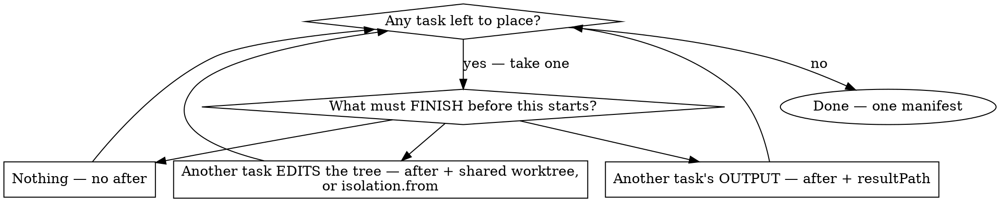

# Execution strategy — deciding the shape before anything spends

**Mandatory reading before the offer gate.** The gate asks how many leaves, on which
models, at which batching point. None of that is answerable from the request alone, and a
leaf count invented at the moment you are asked to justify one is the failure this page
exists to prevent.

Work through it in order. Every step produces an input the gate consumes.

---

## 1. Grouping — invoke `swarm:orchestrating-agents` first

**Not optional, and not summarisable here.** That skill owns the onboarding arithmetic:
a fan-out's dominant fixed cost is onboarding (system prompt, rule files, project
instructions, tool schemas), re-paid at full rate by every agent with no cache credit
across them, so **every merge of two items into one leaf saves an entire onboarding.**

It produces the number the gate's third question carries. Drafting a leaf-per-item
manifest without it is precisely the failure it was written to catch.

## 2. Frame the contract — before the manifest, not after

```
goal · return_shape · must_be_sure · scope{in,out} · done_when
```

- **scope** → per-leaf prompts and file scopes
- **must_be_sure** → `digest.instructions`
- **done_when** → what you check after the run

A contract you cannot state is a manifest you cannot defend line by line, which is a
manifest you should not dispatch.

## 3. Place each task — the shape falls out, you never pick it

**A manifest is a dependency graph, not one pattern stamped across every task.** Take one
task at a time and ask what must FINISH before it can start. Width is an output of the
answers.



Loop until every task is placed. One manifest holds as many segments as the work needs.

**Output vs edits is the discriminating question**, not whether leaves touch the same repo.
`{{result:}}` passes text and changes nothing. Leaves editing disjoint files stay parallel
with private trees; only *accumulation* needs a shared tree or `isolation.from`.

**Two tasks sharing a prerequisite but not each other run in parallel.** Answer against the
work, not against the task above it in your list. Chain them only for a real collision —
same file, same region — and name that file in the prompt.

### The names are descriptions, not a menu

A "fan-out" or a "chain" is just what a *segment* of the graph looks like once its tasks
are placed. Naming one does not commit the rest of the manifest to it:

| A task answers… | That segment reads as |
|---|---|
| **nothing** | fan-out — independent leaves. Also a judge panel, when N leaves take one question |
| **another's output** | chain — each link consuming the last via `{{result:}}` / `{{resultPath:}}` |
| **the previous one edits** | phased chain — one shared worktree, implement → review → implement |
| **a list only known at runtime** | `forEach` — the leaf cloned per item of a dependency's result |
| **an earlier task's commits** | widening — `isolation.from` seeds private trees from that branch |
| **several branches at once** | `integrate` — an agentless merge folding them back into one tree |

**Width changes as often as the work demands.** A fan-out can feed a chain, which can end in
an `integrate`, which can re-branch into another fan-out, which integrates again — all in one
manifest. `1 → N → 1 → M → 1` is ordinary, not a special case, because each task is placed
by its own answer to "what must FINISH before this starts?" and nothing forces neighbouring
segments to share a shape.

There is no manifest-level shape to choose. There is only the per-task question, asked until
every task is placed.

Field-by-field semantics for each: [authoring.md](authoring.md).

## 4. It is one manifest

**You never need a second wave.** Every reason to reach for one has a first-class field,
and the engine resolves it at runtime:

| "I can't write that yet because…" | The field that handles it |
|---|---|
| I don't know how many items there are | `forEach: { from, path, maxItems }` — clones the leaf per item of a **dependency's actual result** (`scheduler.mjs:715`), splicing tasks into the graph mid-run |
| I don't know whether that segment should run | `when: { from, expr }` — else the task completes as `skipped` |
| the input is derived from earlier output | `compute` — an agentless expression step over `deps`, spends nothing |
| the leaf must read all of a dependency's output | `{{resultPath:<id>}}` — the result file itself, uncapped |
| later leaves must build on an earlier one's **commits** | `isolation: { worktree, from: "<task>" }` — a private tree seeded from that task's branch, not repo HEAD |
| parallel branches must be folded back together | `integrate: { into, from: [...] }` — an agentless merge node; **a conflict is not a failure**, markers land in the tree and the paths in its result for the next leaf to resolve |
| it's a whole sub-graph | a `manifest` node — a saved child manifest as one node |

That combination is what makes width free to change: `1 → 2 → 1` in one manifest —
a shared step, a fan-out whose private trees already contain its commit, then an
`integrate` that merges them back (README, *Widening after a narrow step*).

**The one thing that cannot be automated** is a judgement someone must make *between*
segments — compressing findings into `[SHARED_CONTEXT]`, or an operator verdict. Stopping
for that is a deliberate choice to put a human in the loop, and it is the only reason to
run a second manifest. Never reach for it because the graph looks hard to write; the fields
above are how the graph gets written.

A second manifest is a different manifest: different prompts, fresh spend, full gate.

## 5. Models — real names, real numbers

- `models` — the launchable `:cloud` names and Claude aliases, so the manifest names
  something the account can actually launch right now.
- `quota` — run it whenever the mix includes Claude models, and put the real figures in
  the gate's second question. The mix decision is made against remaining usage, not a guess.
- Per-leaf tier and effort guidance: [references/model-selection.md](references/model-selection.md).

Never assume Claude models are spendable. If the user picks alternative-only, recast every
Claude role — digest included — onto a capable `:cloud` model before running.

## 6. Cost, both sides

The gate's first question quotes both:

```
swarm: <the estimate line from validate> · inline: ~<N>k tokens
```

The inline side is **required** and counted mechanically — Glob plus line counts over the
file scope you just wrote into the leaf prompts, then `total lines × ~10`. Where no inline
path exists (judge panels, cross-model dissent, generation), write `inline: not comparable`
plus one clause saying why.

`estimate: none` on a cold corpus is itself the honest answer. **Never invent a number on
either side.** `run-swarm.mjs --inline-lines <n> [--not-comparable]` does this arithmetic.

## 7. Validate, then gate

`validate <manifest>` surfaces id, dependency, governance, and effort errors now rather
than after a background wait. A manifest that fails validation is not ready to be offered.

Then, and only then, the offer gate — the user's answer is the only consent to spend.
